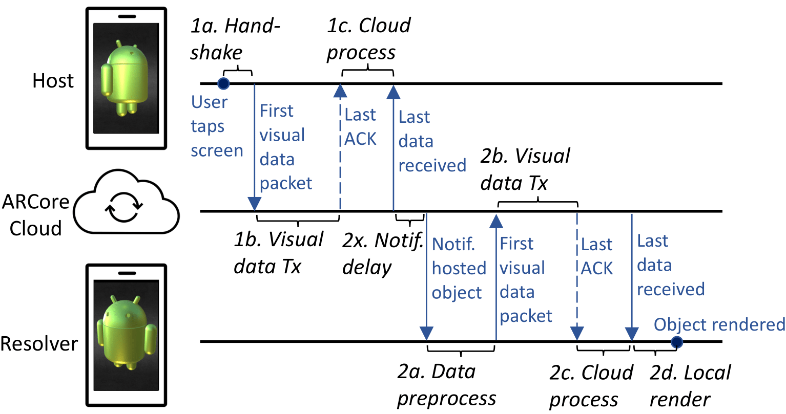

# Can 5G mmWave support Multi-User AR?
Data from our PAM 2022 publication where we conducted multi-user AR measurements over 5G mmWave and LTE networks

If you use this dataset in your publication, please cite us as follows:
```
@InProceedings{ghoshal:pam2022,
author={Ghoshal, Moinak and Das, Pranab and Kong, Zhaoning and Xu, Qiang and Hu, Y. Charlie and Koutsonikolas, Dimitrios and Li, Yuanjie},
title={Can 5G mmWave support Multi-User AR?},
booktitle={Passive and Active Measurement (PAM)},
year={2022}
}
```
## Multi-user AR Application Workflow

Below is an image of the workflow of multi-user AR applications. The image also shows the different components of the end-to-end latency (1a-1c, 2x and 2a-2d).



## Dataset Description

The data directory contains different directories pertaining to various experiments done in this work:

1. Baseline experiment (Section 4.1-4.5) 
2. Varying MSS experiment (Section 4.6)
3. ICMP background traffic experiment (Section 4.6)
4. Power data (Section 5)

Each such directory has sub directories based on the type of experiments. There are two parts to each data collected: Host and the Resolver data.

The Host and Resolver directories contain 2 files: 
* **capture.pcap**: Packet capture file recorded while doing the measurements. We use this file to extract the latency components discussed in Section 4 of the paper.
* **static_log.logcat**: This file contains application logged timestamps of events like tapping the screen to place an object or when an object resolution is finished.

## Scripts

We use a python script `scripts/get_delay_from_capture_files.py` to extract the latency from the capture.pcap and static_log.logcat files. 

The script needs an external package `pyshark`. Use the following command to install `pyshark`.

```
python3 -m pip install pyshark
```

We run the script as follows:

```
python3 get_delay_from_capture_files.py <path_to_host_resolver_subdirectory>
```

Note: To run the script, the directory structure has to be the following:
```
Example: 
/home/user/data/experiment_name/subdirectory/host/run_number

/home/user/data/experiment_name/subdirectory/resolver/run_number

There can be multiple directories (signifying multiple runs) in the host and resolver directories. 

The script can extract latencies for multiple measurement runs provided the name of the run directory is exactly the same in host and resolver directory.
```

The script generates a file called `latency.csv` denoting the latency components for a particular run. 

